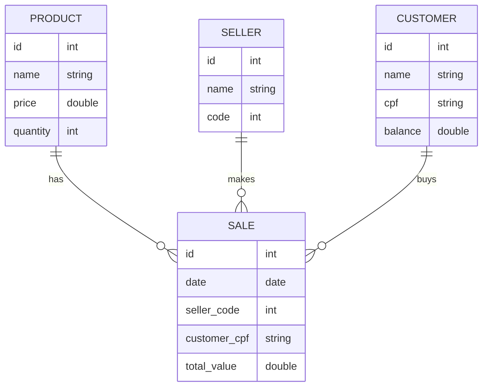

# supermarket
supermarket java crud api rest



## Trechos de código

### Plug-in Maven

```xml
<plugin>
	<groupId>org.apache.maven.plugins</groupId>
	<artifactId>maven-resources-plugin</artifactId>
	<version>3.1.0</version> <!--$NO-MVN-MAN-VER$ -->
</plugin>
```

### application.properties

```
spring.profiles.active=${APP_PROFILE:test}
spring.jpa.open-in-view=false

cors.origins=${CORS_ORIGINS:http://localhost:5173,http://localhost:3000}
```

### application-test.properties

```
# H2 Connection
spring.datasource.url=jdbc:h2:mem:testdb
spring.datasource.username=sa
spring.datasource.password=

# H2 Client
spring.h2.console.enabled=true
spring.h2.console.path=/h2-console

# Show SQL
spring.jpa.show-sql=true
spring.jpa.properties.hibernate.format_sql=true
```

### application-dev.properties

```
#spring.jpa.properties.jakarta.persistence.schema-generation.create-source=metadata
#spring.jpa.properties.jakarta.persistence.schema-generation.scripts.action=create
#spring.jpa.properties.jakarta.persistence.schema-generation.scripts.create-target=create.sql
#spring.jpa.properties.hibernate.hbm2ddl.delimiter=;

spring.datasource.url=jdbc:postgresql://localhost:5432/dscatalog
spring.datasource.username=postgres
spring.datasource.password=1234567

spring.jpa.database-platform=org.hibernate.dialect.PostgreSQLDialect
spring.jpa.properties.hibernate.jdbc.lob.non_contextual_creation=true
spring.jpa.hibernate.ddl-auto=none
```

### application-prod.properties
```
spring.datasource.url=${DB_URL}
spring.datasource.username=${DB_USERNAME}
spring.datasource.password=${DB_PASSWORD}

spring.jpa.database-platform=org.hibernate.dialect.PostgreSQLDialect
spring.jpa.properties.hibernate.jdbc.lob.non_contextual_creation=true
spring.jpa.hibernate.ddl-auto=none
```

### system.properties
```
java.runtime.version=17
```

### WebConfig

```java
@Configuration
public class WebConfig {

	@Value("${cors.origins}")
	private String corsOrigins;
	
	@Bean
	public WebMvcConfigurer corsConfigurer() {
		return new WebMvcConfigurer() {
			@Override
			public void addCorsMappings(CorsRegistry registry) {
				registry.addMapping("/**").allowedMethods("*").allowedOrigins(corsOrigins);
			}
		};
	}
	
}
```
